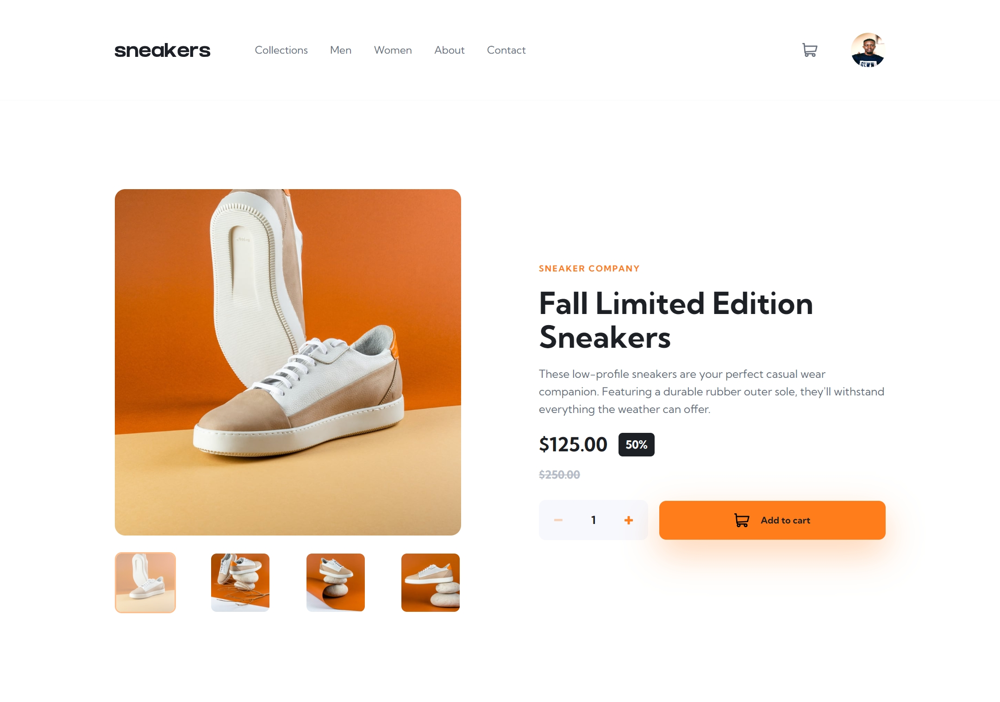
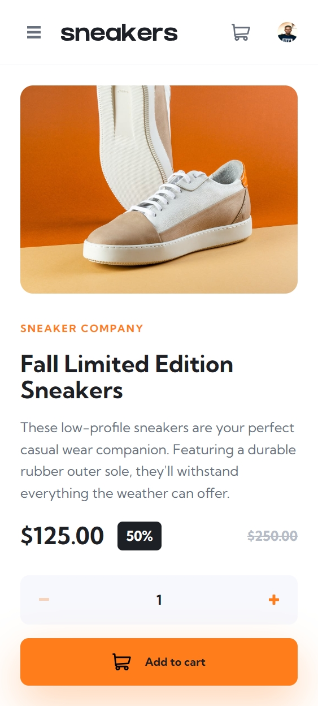
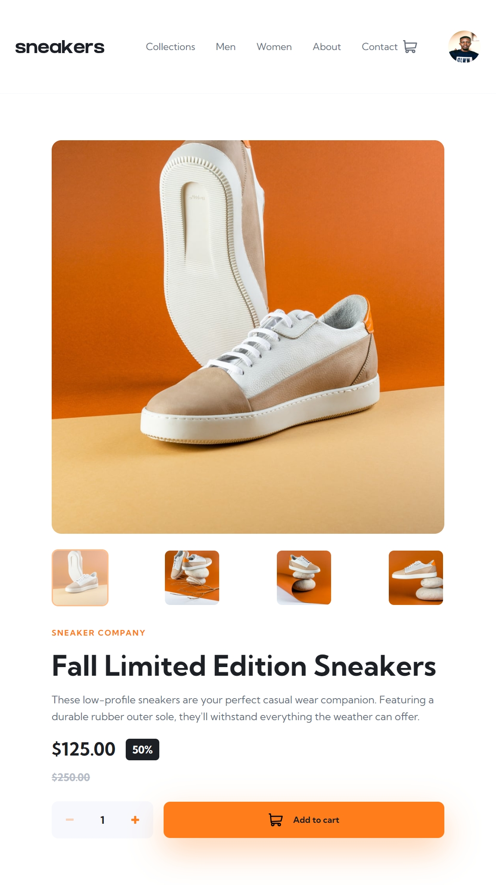
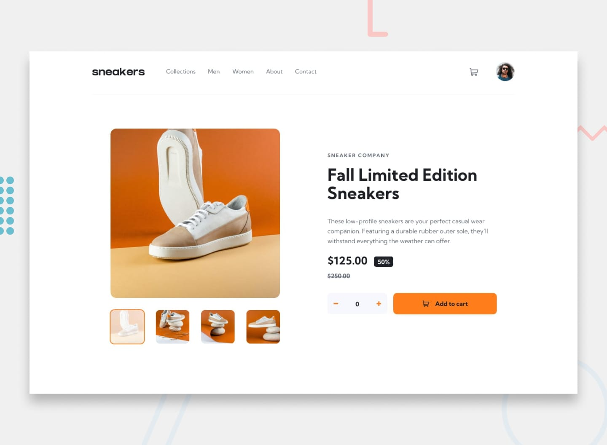

# Frontend Mentor - E-commerce Product Page

A fully responsive e-commerce product page built with **React 19**, **TypeScript**, and **CSS custom properties**. Features an interactive image gallery with lightbox, shopping cart functionality, and mobile-first responsive design.


## Table of Contents

- [Overview](#overview)
- [Features](#features)
- [Tech Stack](#tech-stack)
- [Component Architecture](#component-architecture)
- [Getting Started](#getting-started)
- [Usage](#usage)
- [Author](#author)
- [Acknowledgments](#acknowledgments)

## Overview

A modern, fully functional e-commerce product page showcasing a premium sneaker collection. Built with a focus on clean component architecture, responsive design, and seamless user experience across all devices.

### Screenshots






### The Challenge

Users should be able to:
- View the optimal layout depending on their device's screen size
- See hover states for all interactive elements
- Open a lightbox gallery by clicking on the large product image
- Switch the large product image by clicking on the small thumbnail images
- Add items to the cart
- View the cart and remove items from it

### Screenshot



## Features

### 🛍 Core Features
- **Responsive Layout:** Optimized for mobile (375px) and desktop (1440px) screen sizes
- **Interactive Image Gallery:** Switch product images via thumbnail selection
- **Lightbox Gallery:** Full-screen image viewing with keyboard navigation (desktop only)
- **Smart Mobile Navigation:** Left/right hover zones reveal navigation arrows individually
- **Shopping Cart:** Add/remove items with quantity selection
- **Cart Dropdown:** Mini-cart overlay showing items, quantities, and total price
- **Mobile Menu:** Slide-in navigation for mobile devices

### ♿ Accessibility
- Semantic HTML structure
- ARIA labels on all interactive elements
- Keyboard navigation support (Escape, Arrow keys)
- Focus management in mobile menu and lightbox
- Hover states on all interactive elements

## Tech Stack

- **Framework:** React 19 + TypeScript
- **Build Tool:** Vite
- **Styling:** CSS with custom properties (design tokens) + BEM naming convention
- **State Management:** React Context API with `useReducer` pattern
- **Font:** Kumbh Sans (Google Fonts)

## Component Architecture

```
src/
├── components/
│   ├── layout/           # Header, MobileMenu
│   ├── product/          # ProductGallery, Lightbox, ProductInfo
│   └── cart/             # CartDropdown, CartItem
├── context/              # CartContext - global state management
├── data/                 # Static product data
└── types/                # TypeScript interfaces
```

### Key Components

| Component | Responsibility |
|-----------|---------------|
| `Header` | Navigation links, cart trigger with badge, mobile menu toggle |
| `ProductGallery` | Main image display, thumbnail navigation, mobile arrow zones |
| `Lightbox` | Desktop overlay with enlarged images, keyboard controls |
| `ProductInfo` | Product details, pricing, quantity selector, add to cart |
| `CartContext` | Global cart state with add, remove, clear operations |
| `CartDropdown` | Mini-cart overlay with item list and total calculation |
| `MobileMenu` | Slide-in navigation panel for mobile devices |

## Getting Started

1. **Clone the repository**
   ```bash
   git clone <repository-url>
   cd e-commerce-product-page
   ```

2. **Install dependencies**
   ```bash
   npm install
   ```

3. **Start development server**
   ```bash
   npm run dev
   ```

4. **Build for production**
   ```bash
   npm run build
   ```

## Usage

- **Image Navigation:** Click thumbnails to switch the main product image
- **Lightbox:** Click the main image on desktop to open full-screen gallery
- **Mobile Arrows:** Hover over the left or right side of the image to reveal navigation arrows
- **Add to Cart:** Select quantity and click "Add to cart" button
- **View Cart:** Click the cart icon in the header to see cart contents
- **Remove Items:** Click the trash icon next to any item in the cart dropdown
- **Mobile Menu:** Click the hamburger menu icon to open slide-in navigation

## Author

- **Frontend Mentor** - [@yourusername](https://www.frontendmentor.io/profile/yourusername)

**Note:** Update with your actual Frontend Mentor username when submitting.

## Acknowledgments

- [Frontend Mentor](https://www.frontendmentor.io) for the challenge
- [Kumbh Sans](https://fonts.google.com/specimen/Kumbh+Sans) font family from Google Fonts
